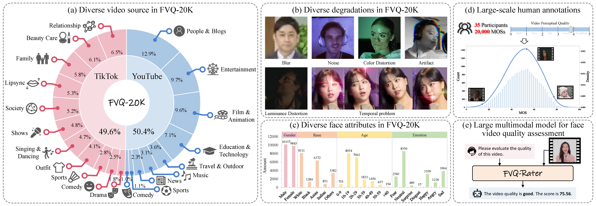

# FVQ: A Large-Scale Dataset and an LMM-based Method for Face Video Quality Assessment (ACM MM 2025)
## [Paper](https://arxiv.org/pdf/2504.09255?) | [Video](https://www.youtube.com/watch?v=Zqm80rcbOjU) | [Dataset](https://huggingface.co/datasets/Human-X/FVQ-20K)

 

We explore the in-the-wild face video quality assessment problem for the first time. Concretely, we present **FVQ-20K**, the first large-scale in-the-wild face video quality assessment dataset, which contains 20,000 face videos with (a) diverse source video content, (b) various distortions in both spatial and temporal domains, (c) a variety of facial attributes, and (d) high-quality MOS annotation for each video. Along with the FVQ-20K dataset, we propose **FVQ-Rater**, the first LMM-based method elaborately designed for the face video quality assessment task as illustrated in (e).


## TODO
- [ ] Release the training code of FVQ-Rater.
- [ ] Release the evaluation code of FVQ-Rater.
- [x] Release the FVQ-20K dataset.


## FVQ-20K Dataset
### Download
The dataset can be downloaded from [Hugging Face](https://huggingface.co/datasets/Human-X/FVQ-20K).

### Overview
- FVQ-20K is an in-the-wild face video quality assessment (FVQA) dataset, which contains 20,000 face videos with MOS annotations.
- The FVQ-20K dataset is divided into training, validation, and test sets with a ratio of 80% : 5% : 15%.

### Data Structure
```
FVQ-20K
│
├── train
│   ├── labels.txt
│   └── videos
│        ├── *.mp4
│        └── ...
├── val
│   ├── labels.txt
│   └── videos
│        ├── *.mp4
│        └── ...
└── test
    ├── labels.txt
    └── videos
         ├── *.mp4
         └── ...

• labels.txt contains video names and their corresponding MOS scores (ranging from 0 to 100).
```

## Citation
If you find our paper useful, please consider citing
```
@article{wu2025fvq,
  title={FVQ: A Large-Scale Dataset and A LMM-based Method for Face Video Quality Assessment},
  author={Wu, Sijing and Li, Yunhao and Xu, Ziwen and Gao, Yixuan and Duan, Huiyu and Sun, Wei and Zhai, Guangtao},
  journal={arXiv preprint arXiv:2504.09255},
  year={2025}
}
```

## Contact
- Sijing Wu [(wusijing@sjtu.edu.cn)](mailto:wusijing@sjtu.edu.cn)
